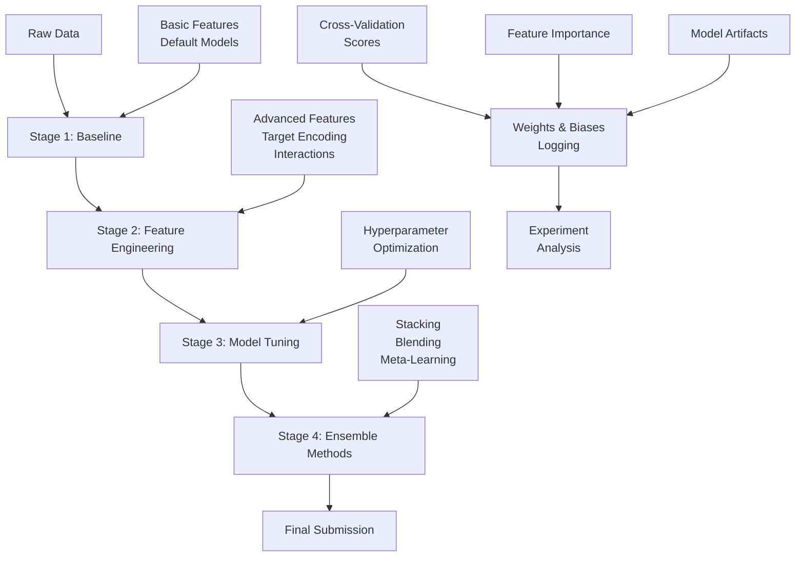

# Titanic Survival Prediction Project

## Project Overview

This project demonstrates a systematic approach to solving the famous [Titanic: Machine Learning from Disaster](https://www.kaggle.com/c/titanic) competition on Kaggle. The Titanic dataset is a classic binary classification problem where we predict passenger survival based on features like age, gender, ticket class, and more.

The framework provides a structured, reproducible pipeline that progresses through four distinct stages, from simple baseline models to advanced ensemble methods. Each stage builds upon the previous one, allowing you to understand the impact of different techniques on model performance.

### Key Features
- **Modular Configuration**: All experiments are defined through YAML files, making it easy to modify and reproduce results
- **Comprehensive Feature Engineering**: From basic preprocessing to advanced techniques like target encoding and interactions
- **Automated Workflow**: Makefile commands handle the entire pipeline from data preparation to submission
- **Experiment Tracking**: Full integration with Weights & Biases for logging and comparison
- **Progressive Complexity**: Clear progression from simple baselines to state-of-the-art ensemble methods

## Quick Start Guide

### Prerequisites
1. Install dependencies: `make install`
2. Set up Weights & Biases: `poetry run wandb login`
3. Place Titanic data files (`train.csv`, `test.csv`) in `data/01_raw/`

### Basic Setup
```bash
# Update project configuration
# Edit conf/projects/titanic/titanic.yaml to set your W&B username
wandb:
  project: "titanic-survival"
  entity: "your-wandb-username"  # Replace with your username
```

### Run Your First Experiment
```bash
# Run baseline LightGBM experiment
make train E=exp001_baseline_lgbm
```

This command will:
1. Generate baseline features
2. Train a LightGBM model with 5-fold cross-validation
3. Log results to Weights & Biases
4. Create submission file in `outputs/`

## Complete Workflow Explanation

The project follows a 4-stage approach, each building on the previous to systematically improve performance:

### Stage 1: Baseline (0.75-0.80 accuracy)
**Goal**: Establish a solid foundation with basic features and default model parameters.

**Key Components**:
- **Feature Engineering** (`v1_baseline`): Basic preprocessing including missing value imputation and simple categorical encoding
- **Features** (`v1_all`): All generated features from the baseline pipeline
- **Model**: LightGBM or CatBoost with default parameters
- **Experiments**: `exp001_baseline_lgbm`, `exp002_baseline_catboost`

**What it includes**:
- Missing value indicators for Age, Cabin, Embarked
- One-hot encoding for categorical variables (Sex, Embarked)
- Standard scaling for numerical features (Age, Fare, SibSp, Parch)
- Family size calculation (SibSp + Parch)

**Commands**:
```bash
make train E=exp001_baseline_lgbm    # LightGBM baseline
make train E=exp002_baseline_catboost # CatBoost baseline
```

### Stage 2: Feature Engineering (0.80-0.85 accuracy)
**Goal**: Enhance model performance through advanced feature engineering techniques.

**Key Components**:
- **Feature Engineering** (`v2_advanced`): Advanced techniques including target encoding, interactions, and binning
- **Features** (`v2_selected`): Statistically selected features using mutual information and model-based importance
- **Model**: Tuned hyperparameters optimized for the enhanced feature set

**Advanced Techniques**:
- Target encoding for categorical features (Sex, Embarked, Pclass)
- Numerical interactions (Age × Pclass, Fare per family member)
- Quantile binning for Age and Fare
- Text features from passenger names (title extraction)
- Ticket frequency encoding
- Decision tree-based binning

**Commands**:
```bash
make train E=exp004_feature_engineering
```

### Stage 3: Model Tuning (0.82-0.87 accuracy)
**Goal**: Optimize hyperparameters to maximize performance on the enhanced feature set.

**Key Components**:
- **Feature Engineering**: `v2_advanced` (same as Stage 2)
- **Features**: `v2_selected` (same as Stage 2)
- **Model**: Hyperparameter optimization using techniques like grid search or Bayesian optimization

**Tuning Parameters**:
- Learning rate, n_estimators, max_depth
- Regularization parameters (reg_alpha, reg_lambda)
- Sampling parameters (subsample, colsample_bytree)
- Minimum samples per leaf/split

**Commands**:
```bash
make tune T=titanic_lgbm E=exp003_tuned_lgbm
make train E=exp003_tuned_lgbm  # Use tuned parameters
```

### Stage 4: Ensemble Methods (0.83-0.88+ accuracy)
**Goal**: Combine multiple models to achieve state-of-the-art performance.

**Ensemble Techniques**:
- **Weighted Averaging** (`exp005_ensemble`): Simple combination of predictions from different models
- **Stacking** (`exp006_stacking`): Meta-learning approach using a second-level model

**Ensemble Components**:
- Base models: LightGBM baseline, CatBoost baseline, tuned LightGBM
- Meta-learner: LightGBM trained on out-of-fold predictions
- Weight optimization: Based on individual model performance

**Commands**:
```bash
# Train base models first
make train E=exp001_baseline_lgbm
make train E=exp002_baseline_catboost
make train E=exp003_tuned_lgbm

# Create ensemble
make train E=exp005_ensemble

# Advanced stacking
make stack S=titanic_stacking_v1
```

## Configuration Reference

### Project Configuration (`titanic.yaml`)
Main project settings including global parameters and W&B configuration:

```yaml
defaults:
  - _self_
  - override /base/model: lgbm
  - override /base/metric: accuracy
  - override /base/validation: stratified

globals:
  seed: 42
  id_col: "PassengerId"
  target_col: "Survived"

wandb:
  project: "titanic-survival"
  entity: "your-wandb-username"
```

### Experiment Configurations
Each experiment defines specific combinations of feature engineering, features, and model parameters:

- `exp001_baseline_lgbm`: Baseline LightGBM with default parameters
- `exp002_baseline_catboost`: Baseline CatBoost with default parameters
- `exp003_tuned_lgbm`: Hyperparameter-tuned LightGBM
- `exp004_feature_engineering`: Demonstrates advanced feature engineering impact
- `exp005_ensemble`: Weighted average ensemble
- `exp006_stacking`: Stacking with meta-learner

### Feature Engineering Configurations
Three levels of complexity:

- `v1_baseline`: Basic preprocessing and encoding
- `v2_advanced`: Target encoding, interactions, binning, text features
- `v3_ensemble`: Additional features optimized for ensemble methods

### Feature Selection Configurations
Three approaches to feature selection:

- `v1_all`: Include all generated features
- `v2_selected`: Statistical and model-based selection
- `v3_important`: Permutation importance and recursive elimination

## Experiment Commands

### Core Workflow Commands
```bash
# Generate features for an experiment
make features E=exp001_baseline_lgbm

# Select important features
make select E=exp001_baseline_lgbm SEL=v2_selected

# Train model with cross-validation
make train E=exp001_baseline_lgbm

# Train on full dataset (for final submission)
make fulltrain E=exp001_baseline_lgbm

# Generate predictions
make predict I=your_inference_config
```

### Advanced Commands
```bash
# Hyperparameter tuning
make tune T=titanic_lgbm E=exp003_tuned_lgbm

# Create stacking ensemble
make stack S=titanic_stacking_v1

# Pseudo-labeling pipeline
make pseudo
```

### Custom Experiment Variables
Override default experiment names:
```bash
make train E=exp004_feature_engineering
make tune T=catboost_search E=exp002_baseline_catboost
```

## Results Interpretation

### Understanding Output Files
After running an experiment, check these locations:

- **`outputs/`**: Local logs and artifacts
  - `models/`: Trained model files
  - `metrics/`: Performance metrics per fold
  - `plots/`: Feature importance and validation curves

- **Weights & Biases**: Online dashboard with:
  - Cross-validation scores
  - Feature importance plots
  - Hyperparameter comparisons
  - Model artifacts

### Key Metrics to Monitor
- **Accuracy**: Primary competition metric
- **F1-Score**: Balance between precision and recall
- **Log Loss**: Probabilistic performance measure
- **Cross-validation stability**: Consistency across folds

### Performance Progression
Expected accuracy ranges by stage:
- Stage 1 (Baseline): 0.75-0.80
- Stage 2 (Feature Engineering): 0.80-0.85
- Stage 3 (Model Tuning): 0.82-0.87
- Stage 4 (Ensemble): 0.83-0.88+

### Analyzing Feature Importance
Use W&B plots to identify:
- Most predictive features
- Feature interactions
- Potential overfitting indicators

## Best Practices

### Experiment Management
1. **Version Control**: Commit configuration changes with experiment results
2. **Naming Convention**: Use descriptive experiment names (e.g., `exp003_tuned_lgbm`)
3. **Documentation**: Comment your YAML files explaining key decisions
4. **Reproducibility**: Always use fixed random seeds

### Feature Engineering
1. **Start Simple**: Begin with baseline features, then add complexity
2. **Validate Impact**: Test each new feature group individually
3. **Avoid Leakage**: Ensure no target information leaks into features
4. **Handle Missing Values**: Use appropriate imputation strategies

### Model Development
1. **Cross-Validation**: Always use stratified CV for imbalanced datasets
2. **Hyperparameter Tuning**: Tune on a subset first, then full pipeline
3. **Ensemble Diversity**: Combine different algorithms and feature sets
4. **Overfitting Prevention**: Monitor validation performance closely

### Competition Strategy
1. **Progressive Improvement**: Follow the 4-stage approach systematically
2. **Local Validation**: Use CV scores as primary metric, not public leaderboard
3. **Multiple Submissions**: Test different approaches before final submission
4. **Time Management**: Balance experimentation time with submission deadlines

## Workflow Diagram



This diagram illustrates the systematic progression through the four stages, with continuous logging and analysis throughout the process.

## Next Steps

1. **Run Baseline Experiments**: Start with `exp001_baseline_lgbm` to establish your foundation
2. **Explore Feature Engineering**: Compare `v1_baseline` vs `v2_advanced` to see the impact
3. **Optimize Hyperparameters**: Use the tuning framework to improve performance
4. **Build Ensembles**: Combine your best models for final submission
5. **Analyze Results**: Use W&B to understand what worked and why

Remember: The key to success in ML competitions is systematic experimentation and learning from each iteration. This framework provides the structure to do exactly that.